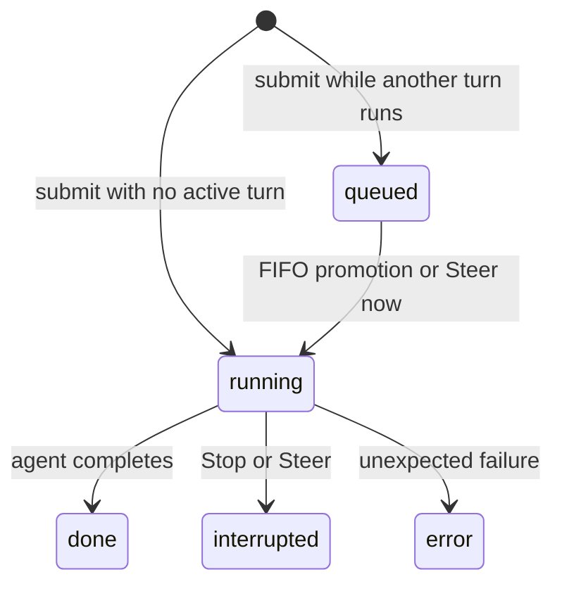
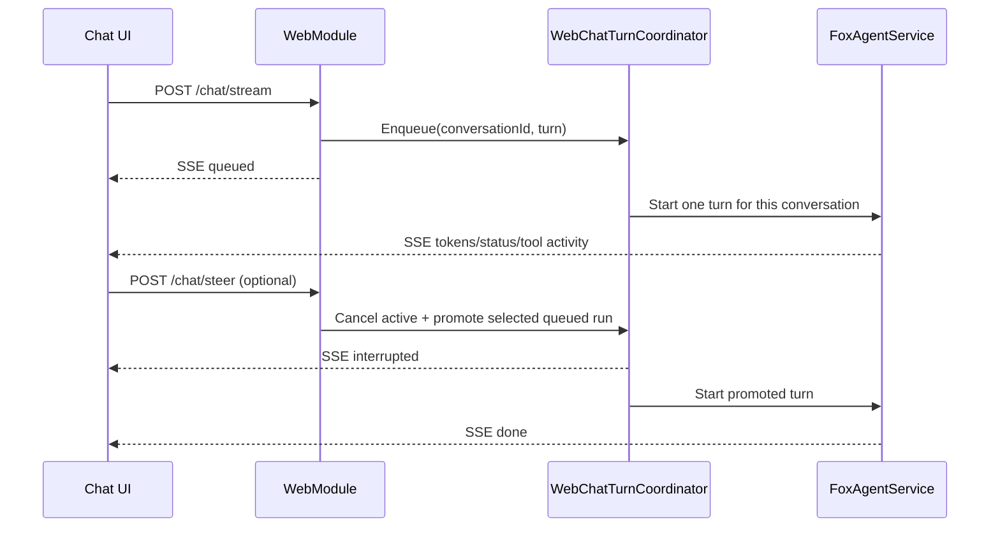

# Agent Fox Chat Message Queue and Steering Guide

## Overview

Agent Fox web chat now supports submitting a new message while another main-agent turn is still running. The new turn is placed in a per-conversation FIFO queue. A queued message can either wait its turn or be steered to the front, which interrupts the active turn and starts the selected message next.

This feature applies to the main web chat flow. Specialist-agent chat keeps its existing behavior.

## User-facing behavior

1. The first message starts streaming immediately.
2. While it is running, submitting another message creates a queued turn. The message bubble shows its queue position.
3. A queued bubble includes **Steer now**. Selecting it requests interruption of the active turn and promotes that queued message.
4. If the active turn finishes normally, the next queued turn starts automatically in FIFO order.
5. **Stop** cancels the active turn only. Queued turns remain queued.
6. A turn can finish as `done`, `interrupted`, or `error`.

The UI uses a run ID for each submission, so multiple outstanding messages can be tracked independently even though they share one conversation.

## Lifecycle



Steering is cooperative cancellation followed by queue promotion. It is not live prompt injection into the model request that is already running. The active agent must reach a cancellation-aware boundary (for example, an LLM or tool call) before the promoted turn can begin.

## Request flow



Each conversation has one active turn at a time. Different conversations can run in parallel.

## Server implementation

`WebChatTurnCoordinator` (`src/Agent/Agents/WebChatTurnCoordinator.cs`) owns the in-memory queue:

- A `ConcurrentDictionary` stores conversation state by conversation ID.
- Each conversation has a FIFO linked-list queue, one active turn, and a cancellation token source.
- `Enqueue` returns a run ID, queue position, completion task, and release handle.
- `Steer` moves a selected queued run to the front and cancels the active run.
- `CancelActive` cancels only the active run.
- A turn is removed from coordinator state after completion and cleanup.

`WebModule` (`src/Agent/Modules/Web/WebModule.cs`) connects HTTP/SSE requests to the coordinator. The request sends the `queued` event immediately, and the coordinator delegate later sends `started`, agent output events, and the terminal event. The request always releases its turn in `finally`, so a disconnected browser cannot leave the queue blocked.

`Program.cs` registers the coordinator as a singleton. This is required so all web requests share the same per-conversation queue.

## SSE events

The existing token/reasoning/status/tool-activity stream remains unchanged. Queue-aware clients should additionally handle these events:

| Event | Payload | Meaning |
| --- | --- | --- |
| `session` | `{ "conversationId": "..." }` | Conversation ID assigned or resumed |
| `queued` | `{ "runId": "...", "position": 1 }` | Turn accepted into the queue |
| `started` | `{ "runId": "..." }` | Turn has become active |
| `interrupted` | `{ "runId": "..." }` | Turn was cancelled by Stop or Steer |
| `done` | `{ "runId": "...", "conversationId": "...", "refs": [...], "assistantIndex": 3 }` | Successful completion |
| `error` | `{ "message": "...", "runId": "..." }` | Failed completion |

The frontend parser in `src/frontend/src/lib/api.ts` exposes these as typed stream events. Chat message state in `src/frontend/src/lib/stores.ts` records `runId` and `queuePosition`.

## Control and inspection endpoints

| Method | Path | Body | Purpose |
| --- | --- | --- | --- |
| `POST` | `/chat/stream` | Existing chat request | Submit and stream a turn |
| `POST` | `/chat/steer` | `{ "conversationId": "...", "runId": "..." }` | Promote a queued run and interrupt the active run |
| `POST` | `/chat/cancel` | `{ "conversationId": "..." }` | Interrupt the active run |
| `GET` | `/chat/queue/{conversationId}` | — | Read active and queued run IDs/positions |

Control endpoints return `{ "ok": true, ... }` on success. They return `404` with `queued_turn_not_found` or `active_turn_not_found` when the requested run has already started, completed, or been removed.

## Cancellation and persistence

The coordinator-owned cancellation token is passed through `FoxAgentService.StreamAsync` into `FoxAgent.ProcessAsync`. A browser disconnect does not cancel the turn; Stop and Steer do.

When cancellation is intentional, `Agent`:

- records an interrupted user message in the Markdown session store,
- saves the current session,
- clears the pending-user sidecar,
- keeps the session resumable, and
- rethrows cancellation so the web layer emits `interrupted`.

The interrupted-message persistence is idempotent. This prevents a queued follow-up from overwriting the user message that belongs to the interrupted turn.

If the browser disconnects after a turn completes, the response is written to `PendingNotificationStore` so it can be surfaced when the session reconnects.

## Scope and limitations

- Queue state is in memory. A process restart loses active and queued web turns.
- Queue state is scoped to one server process; it is not shared across multiple web workers.
- A page reload does not reconstruct the queue bubbles from durable storage. The server can still finish queued work, and completed notifications use the existing pending-notification path.
- Steering cannot undo side effects already completed by the interrupted turn.
- Steering waits for cooperative cancellation; a non-cancellable external operation can delay promotion.
- The feature is implemented for main web chat, not the specialist-agent path.

## Validation

Focused coordinator tests cover:

- serialization within one conversation,
- steering and promotion of a selected queued run, and
- parallel execution across different conversations.

Useful commands from the repository root:

```powershell
dotnet build src/Agent/AgentFox.csproj --no-restore --disable-build-servers --verbosity minimal
dotnet build tests/AgentFox.ChannelTests/AgentFox.ChannelTests.csproj --no-restore --disable-build-servers --verbosity minimal
& .\tests\AgentFox.ChannelTests\bin\Debug\net10.0\AgentFox.ChannelTests.exe --filter WebChatTurnCoordinatorTests --progress off
```

The focused test suite passes. The full test executable still has unrelated browser/crashpad and stock-symbol failures that predate this feature.

## Key files

- [Coordinator](../src/Agent/Agents/WebChatTurnCoordinator.cs)
- [Web chat routes and SSE wiring](../src/Agent/Modules/Web/WebModule.cs)
- [Agent cancellation and interruption persistence](../src/Agent/Agents/Agent.cs)
- [Service cancellation propagation](../src/Agent/Agents/FoxAgentHolder.cs)
- [Markdown interruption persistence](../src/Agent/Memory/MarkdownSessionStore.cs)
- [Frontend stream API](../src/frontend/src/lib/api.ts)
- [Frontend chat state](../src/frontend/src/lib/stores.ts)
- [Chat UI](../src/frontend/src/routes/chat/+page.svelte)
- [Coordinator tests](../tests/AgentFox.ChannelTests/WebChatTurnCoordinatorTests.cs)
