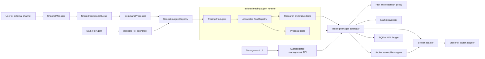
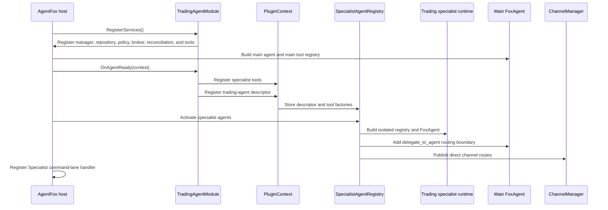
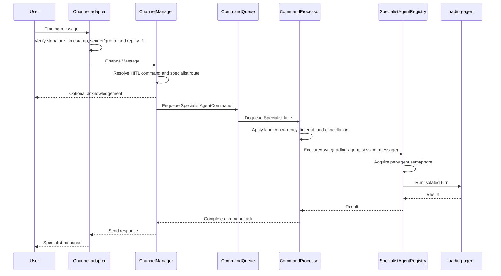
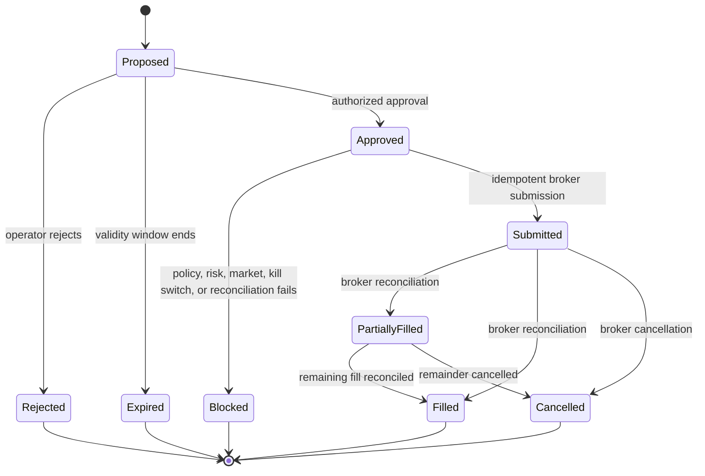

# Specialist Trading Agent: Architecture, Runtime Flow, and UI Management

## 1. Executive summary

The TradingAgent plugin is registered as an isolated **specialist agent** named `trading-agent`. The main AgentFox agent can delegate trade-related questions to it through `delegate_to_agent`, and configured channels such as `whatsapp-bridge` can route directly to it.

The specialist has its own prompt, conversation runtime, concurrency limit, and allowlisted tools. Its public toolset is intentionally limited to research, status, and proposal creation. It cannot place a trade directly. Any execution must cross the deterministic `TradingManager` boundary, where policy, risk, market hours, idempotency, reconciliation health, mode, and kill-switch checks are enforced.

The direct channel flow follows the shared command queue using the dedicated `Specialist` lane. Delegation initiated as a tool call by the main agent executes inline behind the specialist's own semaphore; enqueueing that nested call would deadlock when the main lane is serialized.

UI management is currently **partial**:

- Generic plugin configuration and plugin-session audit APIs exist.
- Frontend API client methods exist for those APIs.
- There is no complete specialist-agent or trading-manager screen.
- There are no dedicated authenticated APIs for proposals, approvals, risk policy, reconciliation, positions, orders, or the kill switch.

The recommended solution is to add a first-class Specialist Agents area and a separate Trading Manager area. Trading controls must use explicit, audited commands rather than the generic plugin-config endpoint.

## 2. Design principles

1. The language model may research, explain, and propose; deterministic code decides whether execution is allowed.
2. Specialist tools are allowlisted. They do not inherit the main agent's entire tool registry.
3. All direct specialist requests use the shared command queue.
4. A per-specialist semaphore prevents overlapping turns for the same trading runtime.
5. A proposal is not an order. Approval and execution are separate state transitions.
6. Live execution fails closed if broker reconciliation is unsupported, unhealthy, or stale.
7. The SQLite ledger is the operational source of truth for proposals, execution attempts, events, and reconciliation runs. It is not a substitute for broker truth.
8. High-risk changes require authentication, authorization, audit logging, and optimistic concurrency/idempotency.

## 3. Component architecture



### Isolation boundary

The specialist descriptor defines:

- stable agent ID;
- description used by the main-agent router;
- dedicated instructions;
- allowed tool names;
- direct channel routes;
- maximum concurrent turns.

At activation, the host builds a separate `FoxAgent` and a separate `ToolRegistry` containing only those allowed tools. The trading specialist therefore cannot silently acquire filesystem, shell, messaging, or unrelated plugin capabilities from the main agent.

## 4. Startup and registration flow



Registration is code-defined during startup. Updating a generic plugin configuration file does not dynamically replace the specialist descriptor, tool allowlist, or runtime concurrency without an explicit lifecycle implementation or application restart.

## 5. Request routing flows

### 5.1 Main-agent delegation

1. A user sends a request to the main agent.
2. The main agent sees `trading-agent` in the description exposed by `delegate_to_agent`.
3. For a trading-domain request, it invokes `delegate_to_agent(agent_id, task)`.
4. The tool calls `SpecialistAgentRegistry.ExecuteAsync` inline.
5. The registry acquires the trading agent's per-agent semaphore.
6. The isolated trading agent handles the task using only its allowlisted tools.
7. The specialist response returns to the main agent, which presents the final response.

This nested delegation is intentionally not placed back onto the command queue. The main agent is already occupying the serialized `Main` lane while its tool call is pending. Waiting for a nested queued command could create a queue dependency cycle. The specialist semaphore still enforces its configured concurrency.

### 5.2 Direct channel routing



The queue priority is:

1. `Main`
2. `Specialist`
3. `Subagent`
4. `Tool`
5. `Background`

The Specialist lane has its own host concurrency limit, while the descriptor's `MaxConcurrentTurns` applies an additional per-agent limit. The trading specialist currently uses a maximum of one concurrent turn to protect conversational and trading state from overlapping requests.

### 5.3 Queue fallback

`ChannelManager` can call the registry directly only when no command queue was provided. The normal hosted application supplies the queue, so production direct-channel traffic uses the Specialist lane. The fallback exists for lightweight hosts and tests; it should be monitored and preferably disabled in production validation.

## 6. Trading decision and execution flow

### 6.1 Research and proposal

1. The specialist parses the user's request and obtains market/account information from read-only tools.
2. It explains assumptions and risk.
3. It invokes the proposal tool with structured order intent.
4. `TradingManager` validates symbols, quantity/notional, policy limits, allowed order types, and market rules.
5. The repository stores an immutable proposal and audit event with a stable ID.
6. The user receives the proposal ID and status. No broker order has been submitted.

### 6.2 Approval and execution state machine



Before any live submission, deterministic code must check:

- execution mode is permitted;
- automatic execution policy is enabled for that proposal type;
- kill switch is not active;
- proposal is current and has not already been executed;
- approval identity and proposal/version hash match;
- symbol, quantity, notional, daily-loss, concentration, and order-type limits pass;
- market session rules pass;
- broker reconciliation is supported, healthy, and fresh;
- the idempotency key has not already been submitted.

Only then may the broker adapter receive the order. Every attempt and outcome is persisted.

### 6.3 Paper, shadow, and live modes

| Mode | Behavior | Recommended use |
|---|---|---|
| Disabled | Research and proposals only; no execution | Default startup |
| Paper | Submit to a deterministic paper broker and record simulated outcomes | Development and UI validation |
| Shadow | Evaluate live data and record the decision that would have occurred, but submit nothing | Policy validation |
| Live / ApprovalRequired | Live submission only after explicit authorized approval and all gates | Controlled rollout |
| Live / BoundedAuto | Autonomous submission only inside strict configured limits and all gates | Final rollout stage only |

The current AHK broker adapter does not provide a reliable positions, balances, orders, and fills read API. It therefore reports reconciliation as unsupported. Because live modes require healthy reconciliation by default, live execution fails closed. Paper, research, status, and proposals remain usable.

### 6.4 Background management

Background actions such as take-profit evaluation must enter through `TradingManager`, not call the broker directly. They are allowed only in an explicitly enabled bounded-auto policy and must pass the same risk, reconciliation, idempotency, and audit controls. Background work should run on the `Background` command lane so interactive traffic remains responsive.

## 7. Persistence and source of truth

The local SQLite database uses WAL mode and stores operational records such as:

- proposals and their lifecycle;
- approvals and rejection/expiry events;
- execution attempts and idempotency keys;
- broker responses;
- reconciliation runs and health;
- audit events.

SQLite is recommended for the transactional control ledger. DuckDB is better suited to analytical workloads and historical market-data queries, not concurrent transactional order state. If analytics grow, add DuckDB as a separate read/analytics store fed from immutable events; do not replace the execution ledger with it.

Broker state remains authoritative for actual cash, positions, open orders, fills, and cancellations. Reconciliation compares broker truth to the local ledger and blocks live execution when the comparison cannot be trusted.

## 8. Current UI manageability

### Current support matrix

| Capability | Backend today | UI today | Status |
|---|---|---|---|
| List/update/delete generic plugin config | `/plugin-config` APIs | API client exists, no discovered management page | Partial |
| Inspect plugin sessions and tool executions | `/plugin-sessions` APIs | API client exists, no discovered management page | Partial |
| View registered specialist descriptors | No dedicated endpoint | No | Missing |
| View Specialist queue depth/running commands | No dedicated endpoint | No | Missing |
| Change specialist prompt/tool allowlist/routes/concurrency | Code/startup descriptor | No | Missing |
| View trading status/mode/kill switch | Agent status tool only | No | Missing |
| Manage proposals and approvals | No dedicated web API | No | Missing |
| View orders, fills, positions, balances | No complete broker/reconciliation API | No | Missing |
| Manage risk policy | Configuration/code | No safe purpose-built API | Missing |
| Inspect reconciliation health/history | Status tool and database | No | Missing |
| Activate/deactivate kill switch | Manager/config path only | No secured operator action | Missing |
| Audit operator changes | Trading ledger covers manager actions, generic config is insufficient | No consolidated view | Partial |

Therefore, the trading specialist is operationally manageable through configuration and conversational tools, but **not yet completely manageable through the web UI**.

The generic plugin-config API should not become the trading control plane. It is suitable for low-risk presentation or prompt settings. Trading policy changes and execution commands need typed validation, authorization, audit records, and concurrency checks.

## 9. Recommended UI architecture

### 9.1 Specialist Agents page

Show a read-only runtime inventory first:

- ID, plugin, description, activation state, and startup errors;
- model/provider and prompt revision;
- allowlisted tools;
- direct channel routes;
- per-agent maximum concurrency;
- active turns, queue depth, last request, latency, and failure count;
- restart-required indicator for descriptor changes.

Allow edits only through a validated draft/publish workflow. Tool allowlist and routes should be selected from known registered values, not arbitrary strings.

### 9.2 Trading overview

Display these safety signals above portfolio metrics:

- `Disabled`, `Paper`, `Shadow`, or `Live` mode;
- kill-switch state;
- broker connectivity;
- reconciliation supported/healthy/last successful age;
- market status and timezone;
- database health;
- pending proposals, open orders, and today's realized/unrealized loss;
- visible warning that live execution is blocked when any mandatory gate is red.

### 9.3 Proposals and approvals

Provide a searchable proposal table and immutable detail page containing:

- symbol, side, quantity, order type, limit/stop values, and estimated notional;
- rationale and originating user/session/channel;
- risk-check results and policy revision;
- created/expires timestamps;
- proposal version/hash;
- approval, rejection, execution, and reconciliation history.

Approval must be a dedicated command requiring the current proposal version/hash. A stale screen must receive `409 Conflict`, forcing the operator to reload. Approval must never be a simple editable status field.

### 9.4 Orders and portfolio

Show local ledger state beside broker state and highlight discrepancies. Include orders, fills, partial fills, cancellations, positions, balances, realized/unrealized P&L, and the reconciliation run that verified each value.

### 9.5 Risk and execution policy

Use typed fields with units and validation for:

- permitted modes and symbols;
- per-order quantity/notional limits;
- daily loss and concentration limits;
- allowed order types and trading hours;
- proposal expiry;
- auto-execution bounds;
- reconciliation interval and maximum age.

Policy edits should create a new version with author, timestamp, reason, and diff. Activating a risk-loosening change should require elevated permission and optional second-person approval.

### 9.6 Audit and diagnostics

Unify specialist turns, tool calls, proposals, operator actions, broker submissions, and reconciliation events by correlation ID. Secrets, credentials, webhook signatures, and sensitive broker payload fields must be redacted.

## 10. Recommended management API

The exact route prefix may follow the existing web module convention, but the resource boundaries should be explicit:

```text
GET  /specialist-agents
GET  /specialist-agents/{agentId}
GET  /specialist-agents/{agentId}/metrics
GET  /command-queues

GET  /trading/status
GET  /trading/proposals
POST /trading/proposals
GET  /trading/proposals/{proposalId}
POST /trading/proposals/{proposalId}/approve
POST /trading/proposals/{proposalId}/reject
POST /trading/proposals/{proposalId}/expire

GET  /trading/orders
GET  /trading/executions
GET  /trading/positions
GET  /trading/balances
GET  /trading/reconciliation
POST /trading/reconciliation/run

GET  /trading/policies
POST /trading/policies/drafts
POST /trading/policies/{version}/activate
POST /trading/kill-switch/activate
POST /trading/kill-switch/deactivate
GET  /trading/audit-events
```

Mutation requirements:

- authenticated user identity and role;
- anti-CSRF protection where cookie authentication is used;
- request ID and idempotency key;
- expected resource version/hash;
- reason field for policy, rejection, and kill-switch actions;
- transactional database update and immutable audit event;
- structured error codes explaining which safety gate blocked the request.

Prefer server-sent events or the project's existing streaming mechanism for queue state, reconciliation status, proposal changes, and fills. Polling can be the initial implementation.

## 11. Roles and permissions

| Role | Suggested permissions |
|---|---|
| Viewer | Read specialist health, proposals, portfolio, reconciliation, and audit records |
| Analyst | Viewer plus create proposals; cannot approve or execute |
| Trader | Analyst plus approve/reject proposals within assigned limits |
| Risk Manager | Manage and activate policy versions; review exceptions |
| Administrator | Manage specialist lifecycle, routes, integration configuration, and access |

The kill switch should be activatable by Trader, Risk Manager, and Administrator because stopping risk should be easy. Deactivation should require Risk Manager or Administrator authority, a healthy reconciliation, and an audit reason.

## 12. UI implementation roadmap

### Phase 1: visibility and paper trading

1. Add read-only specialist inventory and queue metrics endpoints.
2. Add trading status, proposal, execution, reconciliation, and audit read endpoints.
3. Build Specialist Agents and Trading Overview pages.
4. Build proposal and paper-order history pages.
5. Run only in Disabled/Paper/Shadow modes.

### Phase 2: controlled operator actions

1. Add authentication and role-based authorization if not already enforced for these routes.
2. Add typed proposal create/reject/approve commands with version checks and idempotency.
3. Add kill-switch activation/deactivation commands.
4. Add versioned risk-policy drafts and activation.
5. Add real-time status updates and alerting.

### Phase 3: broker truth and live readiness

1. Replace or extend the AHK adapter with reliable APIs for balances, positions, open orders, fills, and cancellations.
2. Make reconciliation pass under disconnect, partial-fill, duplicate-request, restart, and stale-data tests.
3. Run Shadow mode for a defined observation period.
4. Enable ApprovalRequired live mode for a tightly limited symbol/notional set.
5. Consider BoundedAuto only after production evidence and an operational review.

## 13. Acceptance criteria

The specialist architecture is complete when:

- main-agent trade questions can be delegated to the isolated trading runtime;
- configured direct channels execute through the Specialist queue lane;
- concurrent turns respect both lane and per-agent limits;
- the trading specialist cannot access non-allowlisted tools;
- proposals cannot bypass `TradingManager`;
- duplicate approval/execution requests cannot duplicate an order;
- live execution is blocked on stale or unsupported reconciliation;
- every material decision has a correlation ID and immutable audit event.

The management UI is complete when:

- an authorized operator can view specialist, queue, broker, reconciliation, proposal, order, portfolio, policy, and audit state;
- high-risk actions use dedicated typed commands, not generic config mutation;
- stale UI actions are rejected using versions/hashes;
- permission boundaries are tested server-side;
- kill-switch activation remains available during degraded broker or agent health;
- secrets never appear in page payloads, logs, or audit details;
- Paper and Shadow workflows can be operated end-to-end before any Live control is exposed.

